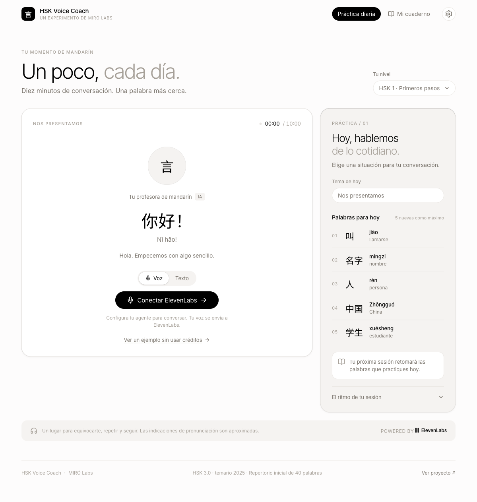
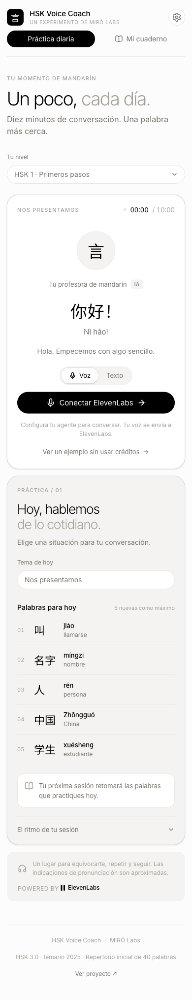

# HSK Voice Coach

Una profesora de mandarín con voz, construida sobre ElevenLabs Agents, para practicar
diez minutos al día siguiendo el vocabulario del HSK.



## El problema

Aprender mandarín falla por falta de conversación, no por falta de material. Las apps de
tarjetas enseñan a reconocer caracteres, pero nadie practica hablar. Un profesor humano
resuelve eso y cuesta 20-40 USD la hora, con horario fijo. El resultado habitual es un
estudiante que lee HSK 2 y no sabe presentarse en voz alta.

## La solución

Una sesión diaria de diez minutos, hablada, con una profesora de IA que:

- habla principalmente en mandarín y explica en español;
- se limita al vocabulario del nivel HSK seleccionado;
- introduce como máximo cinco palabras nuevas por sesión;
- corrige mostrando 汉字 / pinyin / explicación breve;
- termina con vocabulario practicado, errores, recomendación y una tarea.

Todo queda en un cuaderno local que alimenta la sesión siguiente.

## Arquitectura

```
Navegador (React + Vite)
   │
   ├── @elevenlabs/react  ──WebRTC (voz) / WebSocket (texto)──►  ElevenLabs Agent
   │      · dynamicVariables: nivel, tema, vocabulario permitido
   │      · clientTool record_learning ◄── el agente registra lo aprendido
   │
   ├── src/learning.mjs   capa de validación (el agente no puede mentir)
   │
   └── localStorage       cuaderno de sesiones
```

Sin backend y sin base de datos. El Agent ID es público por diseño; **no hay ninguna API
key en el cliente**, así que no hace falta un servidor que la proteja.

| Archivo | Responsabilidad |
|---|---|
| `src/App.tsx` | UI y ciclo de vida de la sesión |
| `src/learning.mjs` | Plan de la sesión + validación de lo que reporta el agente |
| `src/curriculum.json` | Niveles, temas, vocabulario y límites — todo configurable |
| `agent/system-prompt.md` | System prompt de la profesora |
| `agent/setup.md` | Cómo configurar el agente en el dashboard |
| `tests/learning.test.mjs` | Tests de contrato de la capa de validación |

## Uso de ElevenLabs

- **Agents** para el agente conversacional: voz, system prompt, variables dinámicas y
  herramientas de cliente.
- **`@elevenlabs/react`** (`useConversation`) para la integración: WebRTC en modo voz,
  WebSocket en modo texto, transcripción en vivo y `record_learning` como client tool.
- **Variables dinámicas** para inyectar en cada sesión el nivel, el tema, el vocabulario
  permitido y la recomendación anterior, sin duplicar prompts por nivel.

### La decisión de diseño principal: el agente no puede inventar progreso

Un LLM al que le pides un resumen pedagógico tiende a inflarlo — dice que practicaste
palabras que nunca aparecieron, o inventa correcciones plausibles. Eso convierte la app en
un juguete que te felicita.

Aquí `record_learning` no escribe directamente en el cuaderno. Pasa por
`validateLearningEvent` (`src/learning.mjs:29`), que rechaza:

- **vocabulario fuera de nivel** — el chino debe segmentarse íntegramente en palabras
  permitidas de esta sesión;
- **progreso sin evidencia** — cada palabra de `practiced` debe aparecer literalmente en
  la transcripción;
- **correcciones inventadas** — cada corrección exige una cita exacta de un mensaje real
  del estudiante.

Si falla, la herramienta devuelve un error al agente y este debe corregirse y reintentar.
El cuaderno solo guarda lo que de verdad ocurrió.

## Otras decisiones

- **Sin backend.** Un agente público solo necesita su ID. Añadir un servidor para el MVP
  habría sido arquitectura sin propósito.
- **Vocabulario en JSON, no en el prompt.** Añadir HSK 3 es editar `curriculum.json`.
- **Modo texto además de voz.** Sirve para probar sin gastar créditos de voz y como
  alternativa cuando el reconocimiento falla.
- **Cierre con tiempo límite.** A los 9 minutos la app pide el resumen; si el agente no
  responde en 45 segundos, corta igual y guarda la transcripción sin resumen. Una sesión
  desconectada nunca se marca como completada.

## Limitaciones

- **No evalúa pronunciación.** La plataforma no expone puntuación de tonos, y el prompt
  prohíbe explícitamente al agente fingir que puede medirla. Cualquier indicación de
  pronunciación es orientativa.
- **40 palabras**, no el temario completo (35 de HSK 1 y 5 de HSK 2). Es un repertorio de
  práctica inicial, no una preparación de examen. Ver `docs/hsk-source.md`.
- **El cuaderno vive en un solo navegador.** Sin cuentas ni sincronización. Hay exportación
  a JSON para no perderlo.
- **Sin control de gasto.** Cada sesión consume créditos de ElevenLabs.

## Ejecutar en local

```bash
npm install
cp .env.example .env      # opcional: el Agent ID también se puede pegar en la UI
npm run dev
```

Necesitas un agente propio en ElevenLabs. Los pasos están en
[`agent/setup.md`](agent/setup.md) — se tarda unos diez minutos.

```bash
npm test        # tests de la capa de validación
npm run build   # typecheck + build de producción
```

## Marco HSK

Se usa el temario HSK 3.0 publicado en noviembre de 2025 (implementación indicada para
julio de 2026). Las 40 entradas se verificaron contra sus secciones del documento oficial.
Los ejemplos, explicaciones y roleplays son originales; no se reproduce material de
examen ni de libros de texto. Detalle en [`docs/hsk-source.md`](docs/hsk-source.md).

## Capturas

| Escritorio | Móvil |
|---|---|
|  |  |

## Estado

| Entregable | Estado |
|---|---|
| Aplicación funcional | Hecho |
| Capa de validación + tests | Hecho (7/7) |
| Rediseño con el sistema visual de ElevenLabs | Hecho |
| Agente configurado en ElevenLabs | Pendiente |
| Cinco conversaciones de prueba | Pendiente |
| Despliegue | Pendiente |

Los resultados de las pruebas se publicarán en `docs/pruebas.md` cuando el agente esté
conectado. Este README no afirma que algo funcione antes de haberlo probado.
